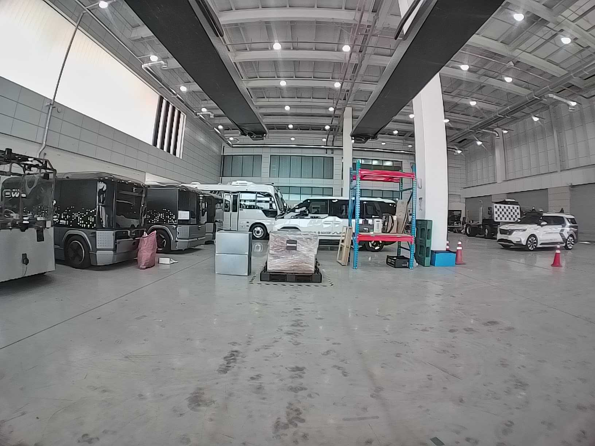
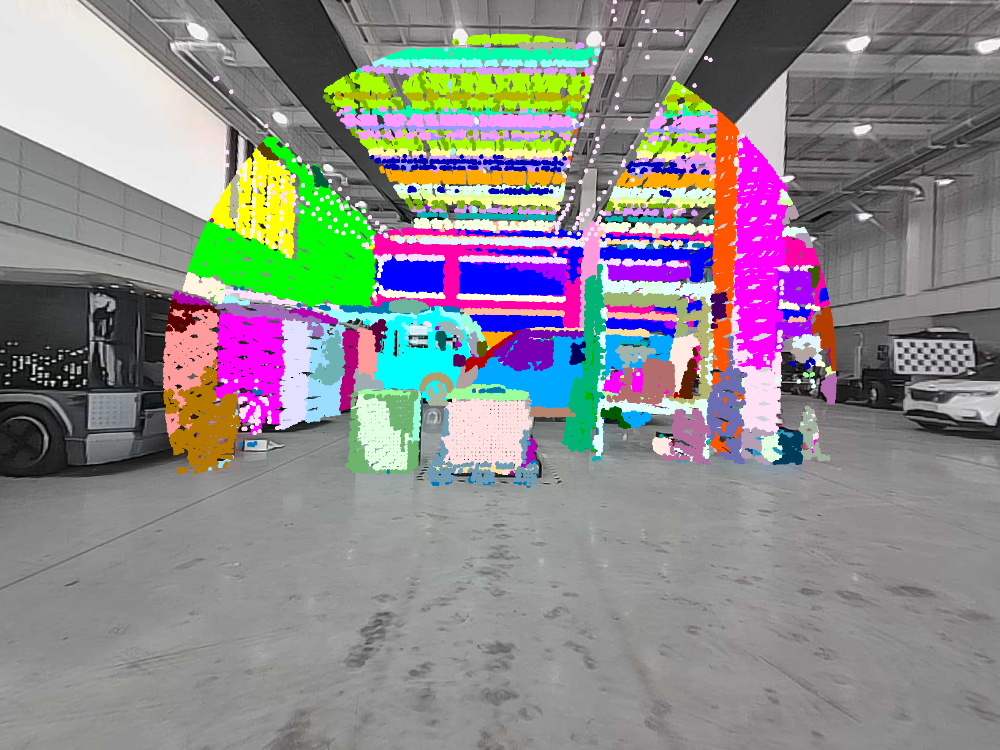

## CalibAnything for Riibotics

This repository is a Riibotics-oriented wrapper around the open-source
[Calib-Anything](https://github.com/OpenCalib/CalibAnything) pipeline for
target-less LiDAR-camera extrinsic calibration with Segment Anything Model
(SAM). The original method is described in
[Calib-Anything: Zero-training LiDAR-Camera Extrinsic Calibration Method Using Segment Anything](https://arxiv.org/abs/2306.02656).

In addition to the upstream C++ calibration code, this fork provides:

- `data_processing/prepare_data.py`: extracts a minimal single-sample dataset from a ROS 2 bag.
- `data_processing/prepare_data_multisample.py`: extracts 3-5 matched single-frame samples from a ROS 2 bag.
- `run_pipeline.sh`: runs SAM mask generation, mask post-processing, build, and calibration in one command.
- `processed_mask.py`: converts raw SAM masks into the processed mask layout expected by CalibAnything.

## Sample Dataset

A reference sample is documented under [samples/README.md](/ws/perception_ws/src/riibotics_perception/tools/calibration/CalibAnything/samples/README.md:1).

- Archive name: `riibotics_mid70_accumulated_success.zip`
- Distribution: external file hosting such as Google Drive or a GitHub Release asset
- Content: prepared input dataset plus reference output images and `extrinsic.txt`

You can use this sample to verify that the executable runs correctly before
trying your own bag data.

Sample segmented projection preview:

Refined segmented projection:




## Compatibility Summary

The helper scripts are compatible with the JSON schema and folder layout used by
the upstream CalibAnything executable.

- `prepare_data.py` generates `calib.json` fields that are read directly by
  [`src/run_lidar2camera.cpp`](/ws/perception_ws/src/riibotics_perception/tools/calibration/CalibAnything/src/run_lidar2camera.cpp:10).
- The output folders match the structure consumed by the upstream loader:
  `images/`, `pc/`, `processed_masks/`, and `calib.json`.
- `run_pipeline.sh` now resolves paths from the repository location instead of
  the caller's current working directory.

The important limitation is not format compatibility but data quality:
`prepare_data.py` creates one accumulated sample, while
`prepare_data_multisample.py` creates several matched single-frame samples.
Upstream CalibAnything supports both, but calibration is usually more stable
with multiple well-overlapped samples.

## Note that the whole process (especially if you reduce voxel size) require minimum 10 ~ 30 min !

## Recommended Environment

Tested target environment:

- Ubuntu 22.04
- ROS 2 Humble
- NVIDIA GPU capable of running SAM

Python packages commonly required:

- `numpy`
- `opencv-python`
- `torch`
- `torchvision`
- `pycocotools`
- `onnx`
- `onnxruntime`
- `matplotlib`
- `cv_bridge`
- `rosbag2_py`
- `rclpy`
- `rosidl_runtime_py`
- `sensor_msgs_py`

Native dependencies:

- PCL
- Eigen3
- OpenCV
- jsoncpp

## Build

```bash
git clone https://github.com/OpenCalib/CalibAnything.git
cd CalibAnything
cmake -S . -B build
cmake --build build -j"$(nproc)"
```

This fork uses the same C++ build path and produces `./bin/run_lidar2camera`.

## Data Collection Guidelines

Before using the scripts, collect data in a scene that gives the optimizer a
reasonable chance to converge.

- Prefer scenes with several planes and objects at different depths.
- Keep strong camera-LiDAR overlap. Small overlap often fails.
- Avoid scenes dominated by sky, glass, or very far structure.
- Keep the sensor rig static while recording the calibration scene.
- If possible, capture more than one valid frame pair even if you start with the
  minimal one-sample workflow below.

## Workflow

Important:

- `run_pipeline.sh` does not read a ROS 2 bag directly.
- A rosbag alone is not enough to start the pipeline.
- You must first run one of the data preparation scripts, or manually prepare
  `images/`, `pc/`, and `calib.json` in CalibAnything format.

### 1. Extract Data from ROS 2 Bag

For a single accumulated sample:

```bash
python3 data_processing/prepare_data.py \
  --bag-path /path/to/rosbag2_dir \
  --lidar-topic /fork_lidar \
  --image-topic /fork_camera/rgb \
  --cam-info-topic /fork_camera/rgb_info \
  --output-dir ./dataset1
```

For 3-5 matched single-frame samples:

```bash
python3 data_processing/prepare_data_multisample.py \
  --bag-path /path/to/rosbag2_dir \
  --lidar-topic /fork_lidar \
  --image-topic /fork_camera/rgb \
  --cam-info-topic /fork_camera/rgb_info \
  --output-dir ./dataset1 \
  --sample-count 5
```

Notes:

- Pass the rosbag directory path. If you pass a `.db3` or `.mcap` file, the
  script uses its parent directory automatically.
- `prepare_data.py` accumulates LiDAR points for `2.0` seconds by default.
- `prepare_data_multisample.py` matches each lidar frame to the nearest camera
  frame within `--sync-tolerance-ms` and exports multiple samples.
- `prepare_data_multisample.py` uses bag timestamps by default for matching.
  If your drivers publish reliable `header.stamp`, you can switch to
  `--timestamp-source header`.
- The generated `calib.json` is only a starting point. You should still review
  `T_lidar_to_cam`, `search_range`, `cluster_tolerance`, and
  `min_plane_point_num`.

The generated folder layout is:

```text
dataset1/
├── calib.json
├── images/
│   ├── 000000.png
│   ├── 000001.png
│   └── ...
├── pc/
│   ├── 000000.pcd
│   ├── 000001.pcd
│   └── ...
├── masks/
└── processed_masks/
```

### 2. Review `calib.json`

The upstream executable reads the following fields from `calib.json`:

- `cam_K`
- `cam_dist`
- `T_lidar_to_cam`
- `T_lidar_to_cam_gt`
- `img_folder`
- `mask_folder`
- `pc_folder`
- `img_format`
- `pc_format`
- `file_name`
- `params.search_range`
- `params.min_plane_point_num`
- `params.cluster_tolerance`
- `params.point_range`
- `params.search_num`
- `params.thread`
- `params.down_sample`

The most important practical item is `T_lidar_to_cam`. The default matrix in
`prepare_data.py` is only a rough placeholder. If your true installation error
is larger than the search range, calibration can fail even though the JSON
format is valid.

### 3. Run the Full Pipeline

After `prepare_data.py` has generated the dataset, and after you have reviewed
`calib.json`, run:

```bash
./run_pipeline.sh
```

The script performs:

1. SAM repository and checkpoint validation.
2. SAM automatic mask generation into `dataset1/masks`.
3. `processed_mask.py` conversion into `dataset1/processed_masks`.
4. C++ build with CMake.
5. Calibration with `./bin/run_lidar2camera`.

Optional environment variable overrides:

```bash
DATA_DIR=/abs/path/to/dataset1 \
CALIB_JSON=/abs/path/to/dataset1/calib.json \
SAM_DIR=/abs/path/to/segment-anything \
BUILD_DIR=/abs/path/to/build \
./run_pipeline.sh
```

## Running the Upstream Executable Directly

If masks are already prepared, you can bypass `run_pipeline.sh` and execute the
original program interface directly:

```bash
./bin/run_lidar2camera ./dataset1/calib.json
```

This is the same entry point used by the open-source CalibAnything project.

## Run With the Sample

If you want to test the program without preparing a rosbag first:

1. Download `riibotics_mid70_accumulated_success.zip` from your external sample location.
2. Extract the archive under `samples/`.
3. Build the project if needed.
4. Run:

```bash
./bin/run_lidar2camera ./samples/riibotics_mid70_accumulated_success/input/calib.json
```

Compare the newly written `init_proj.png`, `refined_proj.png`, and
`extrinsic.txt` in the repository root against the reference files included in
the sample archive.

## Outputs

The executable writes result images and the estimated extrinsic in the current
working directory:

- `init_proj.png`
- `init_proj_seg.png`
- `gt_proj.png`
- `gt_proj_seg.png`
- `refined_proj.png`
- `refined_proj_seg.png`
- `extrinsic.txt`

When `run_pipeline.sh` launches the binary, these files are written into the
repository root.

## Known Limitations

- `prepare_data.py` creates a one-sample dataset. This is valid for the loader,
  but it is less robust than multi-sample calibration.
- `prepare_data_multisample.py` uses timestamp matching from the bag and can
  still fail if no image-lidar pairs fall within the configured tolerance.
- The selected image is only approximately synchronized with the accumulated
  LiDAR window. For best results, use well-synchronized sensor data.
- The helper scripts assume LiDAR messages include an `intensity` field.
- SAM requires a GPU for practical runtime.
- `processed_mask.py` expects the output directory not to exist in advance. The
  pipeline script removes and recreates it automatically.

## When Calibration Quality Is Poor

Check these items first:

- The initial extrinsic is within the configured search range.
- The camera and LiDAR actually observe the same structures.
- The point cloud contains enough planar and clustered structure.
- SAM masks are not dominated by irrelevant regions.
- `cluster_tolerance`, `min_plane_point_num`, and `down_sample.voxel_m` match
  the density of your LiDAR.

## Citation

If you use this project in research, please cite the original paper:

```text
@misc{luo2023calibanything,
      title={Calib-Anything: Zero-training LiDAR-Camera Extrinsic Calibration Method Using Segment Anything},
      author={Zhaotong Luo and Guohang Yan and Yikang Li},
      year={2023},
      eprint={2306.02656},
      archivePrefix={arXiv},
      primaryClass={cs.CV}
}
```
